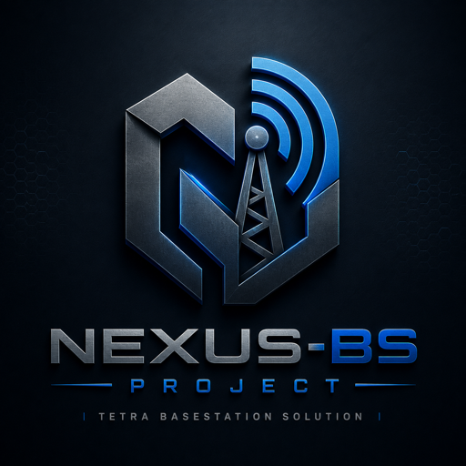
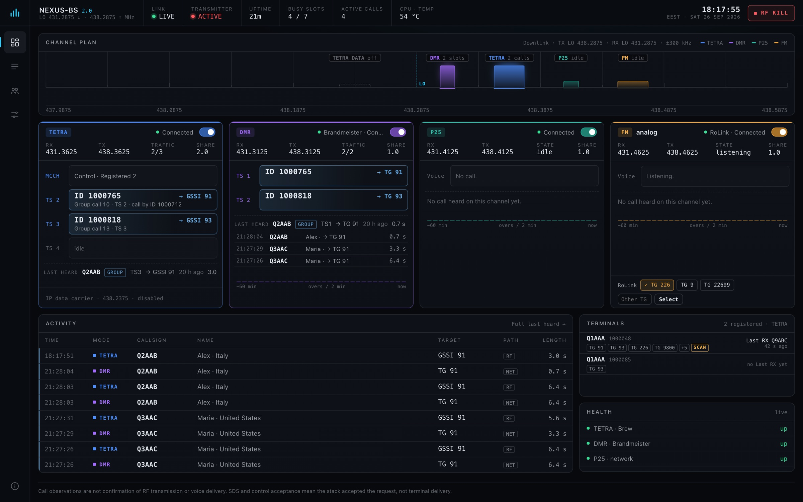

  

<h1 align="center">Nexus-BS 2.0</h1>

<b>One SDR. Four radio systems. On the air together.</b> 
TETRA · DMR · P25 · analog FM, from a single SDR on a Raspberry Pi.

  <a href="https://nexus-bs.pages.dev">Website</a> ·
  <a href="docs/Manual_conf.md">Configuration manual</a> ·
  <a href="docs/TX-CALIBRATION.md">TX calibration guide</a> ·
  <a href="../../releases">Downloads</a>

Demo data: every callsign, name and ID in the screenshots is invented.

## What it is

Nexus-BS 2.0 runs a TETRA base station, a DMR repeater, a P25 repeater and an
analog FM repeater at the same time, from one SDR. Each mode is its own
carrier on a 25 kHz grid around one local oscillator, and each can be turned on,
off or restarted without interrupting the others.

| Mode | What you get |
|---|---|
| **TETRA** | Brew / TetraPack core interconnect, group and private (simplex, duplex) calls, SDS and Home Mode Display, talking-party identity, DGNA, IP over TETRA packet data (experimental) |
| **DMR** | Both timeslots, MMDVM homebrew network (e.g. BrandMeister), RF and network access filters |
| **P25** | Reflector link, talkgroup auto-select and reflector list, NAC |
| **FM** | 25 kHz channel with CTCSS, MMDVM FM repeater logic, svxlink (RoLink) or USRP bridge, MDC1200 |

The station is operated from a browser dashboard, comes back on the air by
itself after a power cut or a failed mode, and runs no service as root.

## This repository

This repository holds the **documentation** and the **downloads** for
Nexus-BS 2.0. The runtime itself is not published here.

| | |
|---|---|
| [`docs/Manual_conf.md`](docs/Manual_conf.md) | Configuration manual, every key of `nexus2.toml` · also in [RO](docs/Manual_conf.ro.md), [DE](docs/Manual_conf.de.md), [ES](docs/Manual_conf.es.md), [PT](docs/Manual_conf.pt.md) |
| [`docs/TX-CALIBRATION.md`](docs/TX-CALIBRATION.md) | Where to put the TX local oscillator and how to cancel its spike and the I/Q images from the dashboard |
| [Releases](../../releases) | SD card images for Raspberry Pi (when available) |

## Hardware

- Raspberry Pi 4 or 5.
- One full-duplex SDR:

| SDR | Status |
|---|---|
| SX1255 HATs: SXceiver, Z32IT SX1255 RPi HAT (with or without TQP3M9036 driver) | Field-tested, on the air daily |
| µCell (SX1255) | Device profile ready, to be tested |
| ADALM-Pluto (PlutoSDR) | Device profile ready, to be tested |
| LimeSDR USB, LimeSDR Mini v2, LimeNET Micro | Device profile ready, to be tested |
| Ettus USRP B200 / B210 | Device profile ready, to be tested |
| Any other SoapySDR device | Generic profile, to be tested |

- SDRs deliver a few mW. For real range add an external **linear** PA, a
  duplexer for the 7 MHz split and a low-pass filter.

## Status

Nexus-BS 2.0 is in active development and meant for amateur radio and lab use,
under your own licence and your own responsibility for what you transmit.
TETRA behaviour follows ETSI EN 300 392-2 clause by clause, but Nexus-BS is not
a certified TETRA product. Motorola, Hytera and other manufacturers are named
only to identify tested equipment; Nexus-BS is not affiliated with them.

Nexus-BS 1.x remains available, archived, at
[invictus737/nexus-bs](https://github.com/invictus737/nexus-bs).

## Licence

The documentation in this repository is published under the GNU General
Public License, version 2 or later (see [`LICENSE`](LICENSE)). Nexus-BS credits
work from BlueStation, FlowStation, osmocom-related projects, MMDVM and
liquid-dsp.
